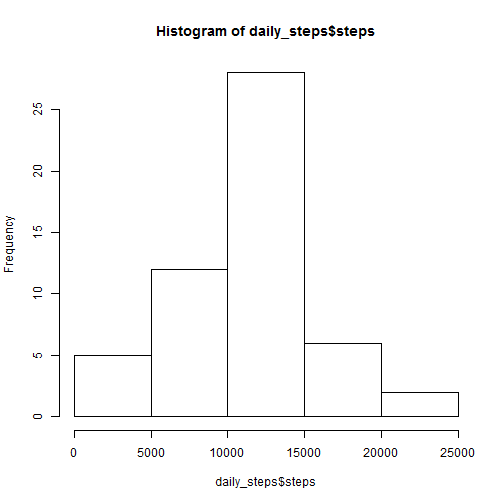
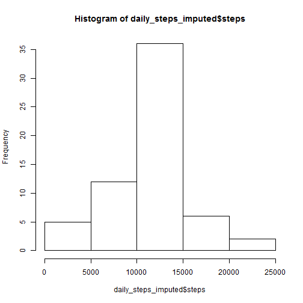
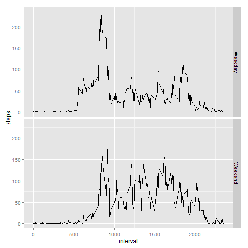

Peer assignment 1, Reproducible Research, Coursera course
========================================================

This assignment makes use of data from a personal activity monitoring device. This device collects data at 5 minute intervals through out the day. The data consists of two months of data from an anonymous individual collected during the months of October and November, 2012 and include the number of steps taken in 5 minute intervals each day.

The variables included in the original dataset are:

    steps: Number of steps taking in a 5-minute interval (missing values are coded as NA)

    date: The date on which the measurement was taken in YYYY-MM-DD format

    interval: Identifier for the 5-minute interval in which measurement was taken


## Loading and preprocessing the data


```r
activity<-read.csv("activity.csv")

#load packages
library(lubridate)
library(dplyr)
```

```
## 
## Attaching package: 'dplyr'
## 
## The following objects are masked from 'package:lubridate':
## 
##     intersect, setdiff, union
## 
## The following object is masked from 'package:stats':
## 
##     filter
## 
## The following objects are masked from 'package:base':
## 
##     intersect, setdiff, setequal, union
```

```r
library(ggplot2)

#add date formatting
activity$act_date<-ymd(activity$date)
```

## What is mean total number of steps taken per day?


```r
daily_steps<-aggregate(activity$steps, list(date=activity$act_date), FUN=sum)

colnames(daily_steps)=c("date","steps")

hist(daily_steps$steps)
```

 

```r
mean(daily_steps$steps, na.rm=TRUE)
```

```
## [1] 10766.19
```

```r
median(daily_steps$steps, na.rm=TRUE)
```

```
## [1] 10765
```

## What is the average daily activity pattern?


```r
mean_per_interval<-activity %>% group_by(interval) %>% summarize(steps=mean(steps, na.rm=TRUE))

plot(steps ~ interval, data=mean_per_interval, type="l")
```

 

```r
#argmax of mean steps 
which_interval_max<-mean_per_interval$interval[which.max(mean_per_interval$steps)]
```

The interval with the maximum mean steps is:  835 

## Imputing missing values

1) Calculate and report the total number of missing values in the dataset (i.e. the total number of rows with NAs)


```r
#number of NAs by column
apply(is.na(activity), 2 , sum)
```

```
##    steps     date interval act_date 
##     2304        0        0        0
```

```r
#number of rows with NA's (now it gives the same as previous) 
sum(!complete.cases(activity))
```

```
## [1] 2304
```

2)-3) Now let's impute NA's with the means by 5-minute interval.


```r
cases_to_impute<-!complete.cases(activity)

activity_imputed<-activity %>% group_by(interval) %>% mutate(mean_steps=mean(steps, na.rm=TRUE))

activity_imputed$steps[cases_to_impute]<-activity_imputed$mean_steps[cases_to_impute]

#remove mean_steps variable
activity_imputed<-activity_imputed %>% select(-mean_steps)
```

4) Let's make histogram, calculate mean, median


```r
daily_steps_imputed<-aggregate(activity_imputed$steps, list(date=activity_imputed$act_date), FUN=sum)

colnames(daily_steps_imputed)=c("date","steps")

hist(daily_steps_imputed$steps)
```

 

```r
mean(daily_steps_imputed$steps, na.rm=TRUE)
```

```
## [1] 10766.19
```

```r
median(daily_steps_imputed$steps, na.rm=TRUE)
```

```
## [1] 10766.19
```

We see on the histogram that as a result of the imputation, there are now much more 'average days', there are more days with steps 10000-15000.

The mean has not changed, which is not surprising, as I imputed with means (and only full days were missing).

The median has changed, but only slightly.

## Are there differences in activity patterns between weekdays and weekends?

First, let's create factor with weekday and weekend levels. 

```r
activity$weekday <- as.factor(ifelse(weekdays( activity$act_date) %in% c("Saturday","Sunday"), "Weekend", "Weekday"))
```

Then create the plots for weekdays, weekends using ggplot2.


```r
mean_per_interval<-activity %>% group_by(weekday, interval) %>% summarize(steps=mean(steps, na.rm=TRUE))

qplot(interval, steps, data=mean_per_interval, facets=weekday~., geom="line") 
```

 

We see that steps during the weekend don't have a peak in the morning, they are spread out more evenly during the day.
